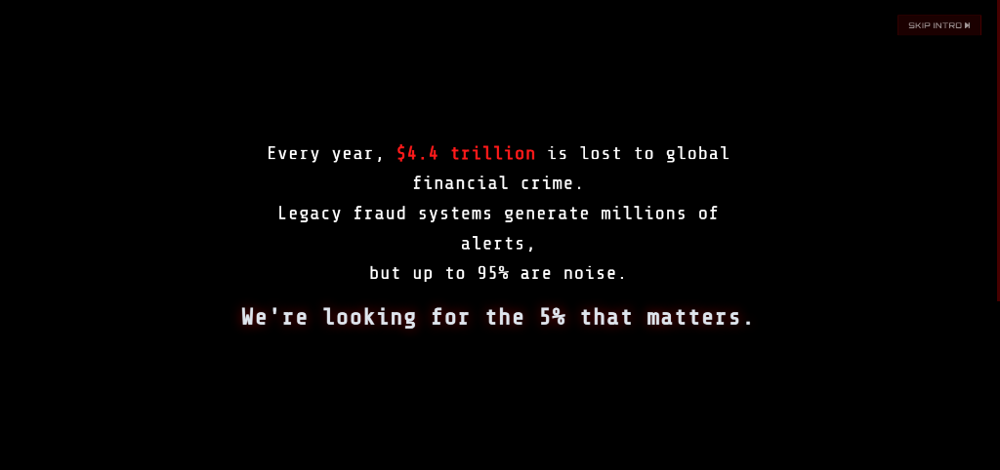
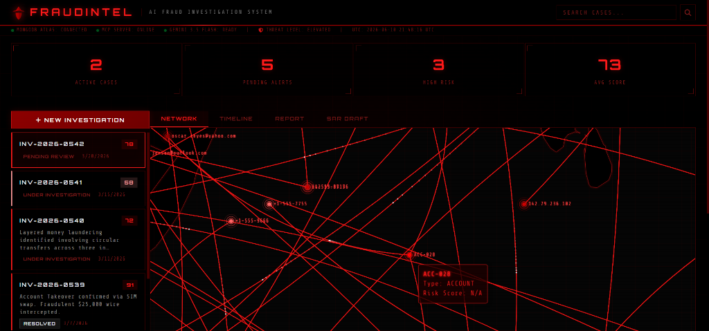
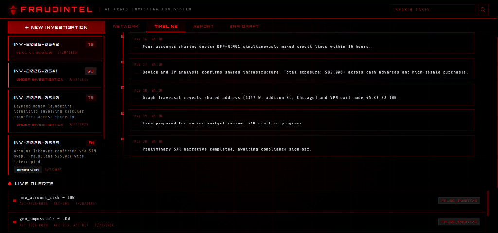
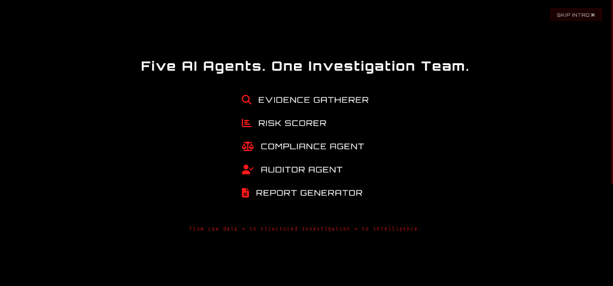

<div align="center">

# 🛡️ FRAUDINTEL

### The AI That Doesn't Answer Questions — It Accepts Missions

<br/>


<br/>

```
D E T E C T I N G  ·  C O N N E C T I N G  ·  I N V E S T I G A T I N G
```

<br/>

[-4285F4?style=for-the-badge&logo=googlecloud&logoColor=white)](https://cloud.google.com/agent-builder)
[](https://deepmind.google/technologies/gemini/)
[](https://www.mongodb.com/atlas)
[](https://modelcontextprotocol.io/)
[](LICENSE)

</div>

---

<div align="center">
<table>
<tr>
<td align="center"><strong>🕐 4–6 hrs</strong><br/>Manual investigation</td>
<td align="center"><strong>→</strong></td>
<td align="center"><strong>⚡ ~90 sec</strong><br/>FraudIntel mission</td>
</tr>
</table>

> **"FraudIntel doesn't answer questions. It accepts missions."**

</div>

---

## 📋 Table of Contents

- [The Problem: Why This Exists](#-the-problem-why-this-exists)
- [The Solution: How It Works](#-the-solution-how-it-works)
- [Platform Preview](#-platform-preview)
- [What Makes FraudIntel Different](#-what-makes-fraudintel-different)
- [Demo](#-demo)
- [Mission Mode — The Feature That Wins](#-mission-mode--the-feature-that-wins)
- [The Six-Agent Architecture](#-the-six-agent-architecture)
- [Core Technical Capabilities](#-core-technical-capabilities)
- [UI/UX - Cinematic Investigation Dashboard](#-uiux---cinematic-investigation-dashboard)
- [System Architecture](#-system-architecture)
- [Quick Start](#-quick-start)
- [Tech Stack](#-tech-stack)
- [Project Structure](#-project-structure)
- [MongoDB Collections](#-mongodb-collections)
- [Real-World Impact](#-real-world-impact)
- [Hackathon Alignment](#-hackathon-alignment)
- [API Reference](#-api-reference)
- [Project Documentation Index](#-project-documentation-index)
- [Next Steps](#-next-steps)

---

## ⚡ The Problem: Why This Exists

Financial crime costs the global economy **$4.4 trillion every year**. Legacy fraud systems generate millions of alerts — but up to **95% are false positives**. Investigators drown in noise while real fraud slips through. 

| ❌ Legacy Systems (Status Quo) | ✅ FraudIntel Command Center |
|---|---|
| **Rule-Based Triggering:** Blocks "IP=Nigeria" causing false declines. | **AI Reasoning:** Understands context (e.g., user is on a corporate VPN). |
| **Siloed Data:** Analysts switch between 5+ tools to gather evidence. | **Unified Graph:** Autonomous collection of database, graph, and vector data. |
| **Black Box Rejection:** Closes alerts without explanation. | **Explainable AI (XAI):** Generates factor-by-factor risk breakdowns. |
| **Reactive Only:** Waits for an alert to trigger. | **Proactive Hunting:** Threat Intel agent hunts for emerging fraud rings automatically. |

---

## 🧠 The Solution: How It Works

```text
┌─────────────────────────┐
│  1. MISSION ASSIGNED    │  "Investigate ACC-001"
│     via Command Center  │  Chief Investigator initializes pipeline.
└───────────┬─────────────┘
            ▼
┌─────────────────────────┐
│  2. EVIDENCE GATHERER   │  MongoDB Atlas API calls
│     Collects Data       │  Fetches TXNs, IPs, Devices
└───────────┬─────────────┘
            ▼
┌─────────────────────────┐
│  3. GRAPH TRAVERSAL     │  $graphLookup execution
│     Detects Fraud Rings │  Links shared devices across N-degrees
└───────────┬─────────────┘
            ▼
┌─────────────────────────┐
│  4. RISK SCORING        │  50+ Weighted Signals
│     + Adversarial Check │  Auditor Agent challenges the findings
└───────────┬─────────────┘
            ▼
┌─────────────────────────┐
│  5. SAR & REPORTING     │  Compliance Agent check
│     Decision Package    │  Ready for Analyst Review
└─────────────────────────┘
```

---

## 🖼️ Platform Preview

| Cinematic Initialization | Fraud Ring Network Graph |
|---|---|
|  |  |
| **Mission Log & Timeline** | **AI Agent Initialization** |
|  |  |

---

## 💡 What Makes FraudIntel Different

Most AI hackathon projects add a chat window and call it an "agent."

**FraudIntel is not a chatbot.**

It is an **AI Investigation Command Center** — a system where human analysts issue investigative missions and a **Chief Investigator AI** orchestrates six specialized sub-agents that reason, plan, execute database operations, traverse entity graphs, score risk, challenge their own conclusions, and produce decision-ready investigation packages.

| ❌ What other projects do | ✅ What FraudIntel does |
|---|---|
| User asks a question → AI responds with text | User issues a mission → AI **executes an investigation** |
| Static responses | Live mission feed showing **visible agent behavior** |
| Single-turn Q&A | **Autonomous follow-up** — discovers related accounts, proposes next actions |
| Black-box answers | Every conclusion has a **"Why?" button** with factor-by-factor explainability |
| One model, one prompt | **Six coordinated agents** with distinct roles, tools, and system prompts |

### The Difference in Action

```
❌ CHATBOT                              ✅ FRAUDINTEL
────────────────────────                ────────────────────────────────
User: Explain this alert.              User: Investigate Alert A-8472.

AI: Here is an explanation              AI: Mission accepted.
of what this alert means...                ✓ Evidence Gatherer → 17 related transactions found
                                           ✓ Risk Scorer → Score: 87/100 (CRITICAL)
                                           ✓ Auditor → Confidence: 92% — no contradictory evidence
                                           ✓ Compliance → SAR threshold exceeded (31 CFR §1020.320)
                                           ✓ Report Generator → Case INV-2026-0847 filed
                                           ✓ Threat Intel → Emerging campaign detected (6 linked cases)

                                        📋 Investigation Package Ready
                                        🔴 Recommended: Freeze account, file SAR, launch ring investigation
```

---

## 🎬 Demo

<p align="center">
  <video src="demo.mp4" width="800" controls>
    Your browser does not support the video tag.
  </video>
</p>

> 📺 **[Watch the 3-minute demo video attached in the repository](demo.mp4)**

---

## 🎯 Mission Mode — The Feature That Wins

FraudIntel's **Command Center** is a goal-based AI interface where analysts issue investigative missions — not questions.

### How It Works

```
┌─────────────────────────────────────────────────────────────────────┐
│  🤖 COMMAND CENTER                                     AI Online ● │
├─────────────────────────────────────────────────────────────────────┤
│                                                                     │
│  ● Evidence  ● Risk  ● Auditor  ● Compliance  ● Report  ● Intel   │
│                                                                     │
│  ┌─ USER ──────────────────────────────────────────────────────┐   │
│  │  Investigate ACC-001 and tell me whether I should file a SAR │   │
│  └─────────────────────────────────────────────────────────────┘   │
│                                                                     │
│  ┌─ CHIEF INVESTIGATOR ───────────────────────────────────────┐   │
│  │  Mission accepted. Initiating investigation pipeline.       │   │
│  │                                                             │   │
│  │  [14:32:01] Evidence Agent started                          │   │
│  │  [14:32:04] Found 17 related transactions                   │   │
│  │  [14:32:07] Discovered shared device fingerprint            │   │
│  │  [14:32:10] Graph traversal depth=4 — fraud ring detected   │   │
│  │  [14:32:14] Risk Score: 87/100 (CRITICAL)                   │   │
│  │  [14:32:18] SAR threshold exceeded — drafting narrative      │   │
│  │  [14:32:26] Investigation complete.                         │   │
│  │                                                             │   │
│  │  📊 Risk: 87/100 │ 🔴 SAR Required │ 🕸️ Fraud ring (4 nodes) │   │
│  │                                                             │   │
│  │  I also found:                                              │   │
│  │  • 3 related accounts sharing device DEV-FP-4821            │   │
│  │  • Structuring pattern detected ($4,900 x 6 transactions)   │   │
│  │  • Emerging campaign: 6 cases in 14 days, same VPN subnet   │   │
│  │                                                             │   │
│  │  Recommended Actions:                                       │   │
│  │  [ ] Freeze account ACC-001                                 │   │
│  │  [ ] File SAR (draft ready — click SAR DRAFT tab)           │   │
│  │  [ ] Escalate to AML team                                   │   │
│  │  [ ] Launch ring investigation for 3 linked accounts        │   │
│  └─────────────────────────────────────────────────────────────┘   │
│                                                                     │
│  ┌─────────────────────────────────────────────────── [Send ▶] ─┐  │
│  │  Enter mission or account ID...                               │  │
│  └───────────────────────────────────────────────────────────────┘  │
└─────────────────────────────────────────────────────────────────────┘
```

### Mission Types

| Mission Command | What the AI Executes |
|---|---|
| `Investigate Alert A-8472` | Full 6-agent investigation pipeline → produces case package |
| `Show me everyone connected to this device` | `$graphLookup` traversal → entity tree visualization |
| `Find the strongest evidence supporting fraud` | Evidence ranking across all collected data points |
| `Challenge the conclusion` | Launches Auditor Agent for adversarial review |
| `Draft a SAR for Case INV-2026-0847` | Compliance Agent + Report Generator → FinCEN-compliant SAR narrative |
| `What should I do next?` | Priority action planner across all active cases |

### Autonomous Follow-Up

Most chatbots stop after one answer. FraudIntel **continues thinking:**

```
Investigation Complete — Risk: 91/100

I also found:
  • 3 related accounts not yet investigated
  • 2 previously flagged devices
  • Structuring pattern detected across 6 transactions

Recommended next actions:
  [ ] Freeze account
  [ ] Escalate to AML team  
  [ ] Generate SAR
  [ ] Launch ring investigation
```

### "Why?" Explainability — Everywhere

Every conclusion is expandable:

```
Risk Score: 92 ───── [Why?]

  +22  Structuring pattern (6 txns at $4,900)
  +17  High-risk geography (Nigeria, Russia)
  +18  Shared device with flagged account ACC-089
  +15  94.7% similarity to confirmed Case #4782
  +20  Prior SAR filed on linked entity
```

---

## 🧠 The Six-Agent Architecture

FraudIntel is not one AI model with one prompt. It is a **team of six specialized AI agents**, each with its own system prompt, tools, and responsibilities — coordinated by a Chief Investigator orchestrator.

### Agent Hierarchy

```
                    ┌──────────────────────────────┐
                    │     🎖️ CHIEF INVESTIGATOR      │
                    │    (Orchestrator / LlmAgent)   │
                    │    "Tell me what you want       │
                    │     accomplished."              │
                    └──────────────┬───────────────┘
                                   │
            ┌──────────────────────┼──────────────────────┐
            │                      │                      │
   ┌────────▼────────┐  ┌────────▼────────┐  ┌─────────▼────────┐
   │ 🔍 EVIDENCE      │  │ 📊 RISK         │  │ 🔎 AUDITOR       │
   │    GATHERER      │  │    SCORER       │  │    AGENT         │
   │                  │  │                 │  │                  │
   │ Collects ALL     │  │ 50+ weighted    │  │ Challenges       │
   │ relevant data    │  │ signals scored  │  │ findings, finds  │
   │ from MongoDB     │  │ deterministic-  │  │ contradictions,  │
   │ via MCP          │  │ ally (0–100)    │  │ identifies gaps  │
   └──────────────────┘  └─────────────────┘  └──────────────────┘
            │                      │                      │
   ┌────────▼────────┐  ┌────────▼────────┐  ┌─────────▼────────┐
   │ ⚖️ COMPLIANCE    │  │ 📝 REPORT       │  │ 🌐 THREAT        │
   │    AGENT         │  │    GENERATOR    │  │    INTELLIGENCE  │
   │                  │  │                 │  │                  │
   │ BSA/AML/FinCEN   │  │ Structured      │  │ Detects emerging │
   │ checks, SAR      │  │ case files,     │  │ fraud campaigns  │
   │ generation       │  │ timelines,      │  │ across multiple  │
   │                  │  │ network graphs  │  │ investigations   │
   └──────────────────┘  └─────────────────┘  └──────────────────┘
```

### Agent Details

| # | Agent | System Prompt Role | MongoDB Tools | Output |
|---|-------|---|---|---|
| 1 | 🔍 **Evidence Gatherer** | Collect all relevant data — transactions, profiles, devices, networks | `find`, `aggregate`, `$lookup`, `$graphLookup` | Raw evidence package |
| 2 | 📊 **Risk Scorer** | Calculate composite fraud score with 50+ weighted signals | Aggregation pipelines, `$vectorSearch` | Score 0–100 + factor breakdown |
| 3 | 🔎 **Auditor** | Challenge findings, find contradictory evidence, identify gaps | Contradictory evidence queries | Confidence rating + gaps list |
| 4 | ⚖️ **Compliance** | Check BSA/AML/FinCEN, draft SAR narratives | Cross-reference watchlists | SAR draft + regulatory flags |
| 5 | 📝 **Report Generator** | Compile investigation report with timeline and network graph | `insertOne`, `updateOne` | Structured case file |
| 6 | 🌐 **Threat Intelligence** | Detect emerging fraud campaigns across cases | Cross-case pattern analysis | Campaign alerts + response plan |

### What Makes This Real "Agentic" AI

| Agentic Capability | FraudIntel Implementation |
|---|---|
| **Reasoning** | Each agent has a specialized system prompt with domain expertise |
| **Planning** | Orchestrator creates an investigation plan before delegating |
| **Tool Use** | Agents call MongoDB tools via MCP — real database operations |
| **Multi-step Execution** | 6-phase pipeline: evidence → scoring → audit → compliance → report → intel |
| **Self-Correction** | Auditor agent challenges findings; if confidence < 85%, re-investigates |
| **Autonomous Follow-up** | Threat Intelligence proactively discovers linked cases |
| **Human Oversight** | Every action logged; human approves before SAR filing |

---

## 🕸️ Core Technical Capabilities

### 1. Fraud Ring Detection — `$graphLookup`

MongoDB's `$graphLookup` recursively traverses entity relationships to expose hidden fraud networks:

```javascript
// Traverses: accounts → devices → IPs → merchants
// Up to 4 hops deep — exposing networks invisible to single-case analysis
[
  { "$match": { "entity_id": "<target>" } },
  { "$graphLookup": {
      "from": "entity_relationships",
      "startWith": "$linked_entity_id",
      "connectFromField": "linked_entity_id",
      "connectToField": "entity_id",
      "maxDepth": 4,
      "depthField": "hop_count",
      "as": "network"
  }}
]
```

**Result:** The dashboard renders an interactive network graph — investigators see fraud rings in seconds, not days.

### 2. Vector-Powered Pattern Matching — Atlas Vector Search

```javascript
// "This transaction is 94.7% similar to confirmed bust-out Case #4782"
[
  { "$vectorSearch": {
      "index": "fraud_pattern_index",
      "path": "embedding",
      "queryVector": [0.123, -0.456, ...],  // Transaction embedding
      "numCandidates": 100,
      "limit": 5
  }}
]
```

### 3. Composite Risk Scoring — 50+ Signals

Deterministic scoring pipeline with full factor-by-factor explainability:

```
Score Factor                Points    Evidence
─────────────────────────   ──────    ─────────────────────────
Structuring pattern          +22      6 transactions at $4,900
High-risk geography          +17      Transfers to Nigeria, Russia
Shared device fingerprint    +18      DEV-FP-4821 linked to ACC-089
Vector similarity match      +15      94.7% match to Case #4782
Prior suspicious activity    +20      SAR filed on linked entity
                            ─────
Total Risk Score              92/100  → CRITICAL
```

### 4. Automated SAR Generation

When investigations conclude with high risk, FraudIntel auto-generates **FinCEN-compliant SAR narratives** following the five-paragraph structure — including BSA E-Filing XML export:

```xml
<!-- GET /api/cases/{case_id}/sar/xml -->
<EFilingBatchXML>
  <Form111>
    <SubjectInformation><SubjectID>ACC-001</SubjectID></SubjectInformation>
    <SuspiciousActivityInfo><RiskScore>92</RiskScore></SuspiciousActivityInfo>
    <Narrative><NarrativeText>...</NarrativeText></Narrative>
  </Form111>
</EFilingBatchXML>
```

### 5. Self-Improving Learning Loop

When analysts override FraudIntel's recommendations, the system records the feedback and adjusts scoring weights:

```
Analyst Decision: false_positive
Override Score: 15 (was 78)
Reason: "Legitimate payroll disbursement — verified with employer"

→ System adjusts velocity scoring weight for payroll-pattern transactions
→ Future similar cases will score lower, reducing false positives
```

### 6. 12 Fraud Typology Playbooks

Pre-loaded detection patterns covering the full spectrum of financial crime:

```
Account Takeover · Synthetic Identity · Bust-Out · Money Laundering
CNP Fraud · BEC · Check Kiting · First-Party Fraud
APP Fraud · Structuring · Mule Accounts · Insider Threats
```

---

## 🎨 UI/UX — Cinematic Investigation Dashboard

FraudIntel's dashboard is designed as a **cyber investigation HUD** — dark mode, glassmorphism, real-time animations, and a cinematic intro sequence that sets the tone for the investigation.

### The Cinematic Intro
The application opens with a 6-screen cinematic sequence: problem statement → the AI team → agent initialization → investigation readiness.
<p align="center">
  
  
</p>

### Investigation Dashboard
The main HUD features real-time case queues, interactive network graphs, investigation timelines, and a floating Command Center.
<p align="center">
  
  
</p>

### Dashboard Features

| Component | Technology | Purpose |
|---|---|---|
| **Network Graph** | ECharts force-directed | Interactive fraud ring visualization from `$graphLookup` |
| **Investigation Timeline** | Custom CSS + JS | Chronological event reconstruction with severity coding |
| **Case Queue** | Real-time sidebar | Priority-ranked investigations with risk badges |
| **Command Center** | Floating chat panel | Mission-based AI interface with live agent status pills |
| **Live Alert Feed** | WebSocket-style updates | Real-time alert stream with severity indicators |
| **System Ticker** | Header status bar | MongoDB Atlas / MCP / Gemini connection status |
| **Risk Gauge** | Animated score display | 0–100 score with factor-by-factor breakdown |

---

## 🏗️ System Architecture

```
┌─────────────────────────────────────────────────────────────────────────┐
│                    INVESTIGATION COMMAND CENTER                          │
│  ┌──────────┐ ┌───────────┐ ┌──────────┐ ┌────────┐ ┌──────────────┐  │
│  │ Case     │ │ Network   │ │ Timeline │ │ SAR    │ │ 🤖 Command   │  │
│  │ Queue    │ │ Graph     │ │ View     │ │ Export │ │    Center    │  │
│  └──────────┘ └───────────┘ └──────────┘ └────────┘ └──────────────┘  │
└──────────────────────────────┬──────────────────────────────────────────┘
                               │ REST API + SSE (real-time mission stream)
                ┌──────────────▼──────────────┐
                │       FastAPI Backend        │
                │  ┌────────────────────────┐  │
                │  │ 🎖️ Chief Investigator    │  │
                │  │   ADK Orchestrator      │  │
                │  │   (Gemini 3 Reasoning)  │  │
                │  │                        │  │
                │  │  ┌────┐┌────┐┌────┐   │  │
                │  │  │ EG ││ RS ││ AU │   │  │
                │  │  └────┘└────┘└────┘   │  │
                │  │  ┌────┐┌────┐┌────┐   │  │
                │  │  │ CO ││ RG ││ TI │   │  │
                │  │  └────┘└────┘└────┘   │  │
                │  └───────────┬────────────┘  │
                └──────────────┼───────────────┘
                               │ MCP Protocol (stdio)
                ┌──────────────▼──────────────┐
                │    MongoDB MCP Server        │
                │  (Official MCP Standard)     │
                └──────────────┬───────────────┘
                               │
                ┌──────────────▼──────────────┐
                │       MongoDB Atlas          │
                │  ┌────────────────────────┐  │
                │  │ 6 Collections          │  │
                │  │ Atlas Vector Search    │  │
                │  │ $graphLookup Traversal │  │
                │  │ Aggregation Pipelines  │  │
                │  │ Change Streams         │  │
                │  └────────────────────────┘  │
                └──────────────────────────────┘

EG = Evidence Gatherer    RS = Risk Scorer       AU = Auditor
CO = Compliance Agent     RG = Report Generator  TI = Threat Intelligence
```

> 📖 **[Read the full Architecture document →](docs/architecture.md)**

---

## 🚀 Quick Start

### Prerequisites

- Python 3.11+
- Node.js 18+ (for MongoDB MCP Server)
- Google Cloud account with Vertex AI API enabled
- MongoDB Atlas account (free M0 tier works)

### 1. Clone & Install

```bash
git clone https://github.com/fraudintel/FraudIntel.git
cd FraudIntel

# Create virtual environment
python -m venv venv
source venv/bin/activate  # Linux/Mac
# or: venv\Scripts\activate  # Windows

# Install dependencies
pip install -r backend/requirements.txt

# Install MongoDB MCP Server
npm install -g mongodb-mcp-server
```

### 2. Configure Environment

```bash
cp backend/.env.example backend/.env
# Edit .env with your credentials:
# - GOOGLE_CLOUD_PROJECT
# - GOOGLE_CLOUD_LOCATION
# - MONGODB_URI
# - GEMINI_MODEL
```

### 3. Seed the Database

```bash
cd backend
python -m data.seed_data
```

### 4. Run the Application

```bash
python -m uvicorn api.server:app --host 0.0.0.0 --port 8080
```

### 5. Open the Dashboard

Navigate to `http://localhost:8080` — the cinematic intro will play, then the investigation dashboard loads.

---

## 🛠️ Tech Stack

| Layer | Technology | Why This Choice |
|---|---|---|
| **AI Reasoning** | Gemini 3 (via Vertex AI) | Best-in-class reasoning for multi-step investigation planning |
| **Agent Framework** | Google ADK (`LlmAgent`) | Native multi-agent orchestration with tool delegation |
| **MCP Integration** | MongoDB MCP Server (stdio) | Standardized, protocol-compliant database access |
| **Database** | MongoDB Atlas | Document model + `$graphLookup` + Vector Search in one platform |
| **Backend** | FastAPI + Pydantic v2 | Async API with SSE streaming for real-time mission updates |
| **Frontend** | HTML/CSS/JS + ECharts | Cinematic dark-mode HUD with force-directed network graphs |
| **Deployment** | Google Cloud Run | Containerized, serverless, auto-scaling |
| **CI/CD** | Google Cloud Build | Automated build-test-deploy pipeline |

---

## 📁 Project Structure

```
FraudIntel/
├── README.md                          # This document
├── LICENSE                            # MIT License
│
├── backend/                           # Backend Application
│   ├── Dockerfile                     # Multi-stage container (Python + Node.js)
│   ├── requirements.txt               # Python dependencies
│   ├── .env                           # Environment configuration
│   │
│   ├── agent/                         # 🧠 AI Agent System
│   │   ├── orchestrator.py            # Chief Investigator — ADK multi-agent orchestrator
│   │   │                              #   ├── run_investigation_agent()  — structured pipeline
│   │   │                              #   └── run_mission()             — SSE mission stream
│   │   ├── mcp_client.py             # MongoDB MCP connection (stdio transport)
│   │   ├── config.py                 # Settings + 12 fraud typology definitions
│   │   ├── database.py               # Async MongoDB utilities (motor driver)
│   │   │
│   │   ├── sub_agents/               # Six specialized sub-agents
│   │   │   ├── evidence_gatherer.py  # 🔍 Collects data from 6+ collections
│   │   │   ├── risk_scorer.py        # 📊 50+ signal composite scoring
│   │   │   ├── auditor.py            # 🔎 Adversarial review & gap analysis
│   │   │   ├── compliance.py         # ⚖️ BSA/AML/FinCEN compliance checks
│   │   │   ├── report_generator.py   # 📝 Structured report + SAR drafts
│   │   │   └── threat_intelligence.py # 🌐 Cross-case campaign detection
│   │   │
│   │   ├── tools/                    # Agent tool definitions (MCP-routed)
│   │   │   ├── mongodb_tools.py      # 20+ MongoDB operations via MCP
│   │   │   ├── investigation_tools.py # Timeline, network graph, SAR generation
│   │   │   └── scoring_tools.py      # Risk calculation + typology classification
│   │   │
│   │   └── prompts/                  # System prompts for all 7 agents
│   │       └── system_prompts.py     # Domain-expert instructions per agent
│   │
│   ├── api/                          # REST API
│   │   ├── server.py                 # FastAPI app (lifespan, CORS, static mount)
│   │   ├── routes/
│   │   │   ├── investigations.py     # /investigate, /mission, /cases, /alerts, /network
│   │   │   └── dashboard.py          # /dashboard/stats, /dashboard/geo
│   │   └── models/
│   │       └── schemas.py            # Pydantic v2 request/response models
│   │
│   ├── data/                         # Seed data & fraud pattern definitions
│   │   ├── seed_data.py              # Populates MongoDB with realistic demo data
│   │   ├── fraud_patterns.json       # 12 fraud typology pattern definitions
│   │   └── sample_scenarios.json     # Pre-built investigation scenarios
│   │
│   └── deploy/                       # Cloud Build & deploy scripts
│
├── frontend/                          # 🎨 Investigation Dashboard
│   ├── index.html                     # Main page — cinematic intro + HUD layout
│   ├── css/styles.css                # Dark-mode glassmorphism + animations
│   ├── js/
│   │   ├── app.js                    # Core application logic + Command Center
│   │   └── network-graph.js          # ECharts force-directed network visualization
│   └── img/                          # Logo assets (SVG + PNG)
│
└── docs/                              # Documentation
    ├── architecture.md               # Full technical architecture document
    ├── USE_CASES.md                  # 7 user categories + 3 investigation scenarios + ROI
    ├── demo-script.md                # 3-minute demo video script
    └── assets/                       # Screenshots and diagrams
```

---

## 📊 MongoDB Collections

| Collection | Documents | Purpose | Key Operations |
|---|---|---|---|
| `transactions` | 500+ | Financial records with embeddings | `$vectorSearch`, compound queries |
| `customers` | 100+ | KYC profiles and behavioral baselines | Profile lookup, risk assessment |
| `entity_relationships` | 300+ | Graph backbone for fraud ring detection | **`$graphLookup`** traversal |
| `investigations` | 20+ | Case files with full audit trails | CRUD, learning loop feedback |
| `fraud_patterns` | 12+ | Typology definitions with vector embeddings | Vector similarity matching |
| `alerts` | 50+ | Alert queue for investigation triggers | Priority queue, status tracking |

---

## 🌍 Real-World Impact

FraudIntel addresses the **$4.4 trillion global financial crime problem** across 7 industry verticals:

| User | Pain Point | FraudIntel Solution | Projected Impact |
|---|---|---|---|
| 🏦 **Bank Fraud Teams** | 500–2,000 alerts/day, 95% false positives | Multi-agent triage in 90s + auto-SAR | 3,500 analyst-hours/week saved |
| 💳 **Payment Processors** | $48B/yr in CNP fraud | 12 playbooks + vector similarity | $2.4M/month prevented |
| 🏛️ **Regulators** | Thousands of SARs to review | Interactive graphs + structured intel | 10x faster SAR processing |
| 🛡️ **Insurance SIUs** | $308B/yr in claims fraud | Entity ring detection | $15M+ recovered/year |
| 🌐 **Crypto Exchanges** | $20B+ in crypto fraud | Multi-hop graph traversal | $1–5M/month frozen |
| 🏥 **Healthcare** | $100B/yr in billing fraud | Billing anomaly + referral mapping | $50–200M recovered/year |
| 🏬 **E-Commerce** | 354% YoY ATO increase | Device fingerprint correlation | $8–12M prevented/year |

> 📖 **[Read the full Use Cases & Impact document →](docs/USE_CASES.md)** — includes 3 detailed investigation scenarios and projected ROI.

---

## 🏆 Hackathon Alignment

- **Hackathon:** Google Cloud — Building Agents for Real-World Challenges
- **Partner Track:** MongoDB
- **Challenge:** *"AI that doesn't just provide answers — it helps you take action."*

### Judging Criteria

| Criterion | How FraudIntel Delivers |
|---|---|
| **Technological Implementation** | 6-agent ADK orchestration + MCP protocol + `$graphLookup` + Vector Search + SSE streaming + Cloud Run deployment |
| **Design** | Cinematic HUD dashboard with glassmorphism, force-directed graphs, real-time animations, and Command Center |
| **Potential Impact** | $4.4T problem → 4hr investigations reduced to 90s → automated SAR filing → fraud ring detection in seconds |
| **Quality of the Idea** | Not a chatbot — a **mission-based AI Investigation Command Center** with autonomous follow-up, adversarial auditing, threat intelligence, and explainable AI |

### What Sets FraudIntel Apart

1. **Goal-Based, Not Q&A** — Users issue missions, not questions. The AI executes multi-step investigations.
2. **Visible Agent Behavior** — Live mission feed shows each agent working in real-time. Judges can *watch* the AI think.
3. **Adversarial Self-Audit** — The Auditor Agent challenges the system's own conclusions. No other project does this.
4. **Autonomous Follow-Up** — After completing a mission, the AI proactively discovers related threats and proposes next actions.
5. **Full Explainability** — Every score, every conclusion, every recommendation has a "Why?" with traced evidence.
6. **Threat Intelligence** — Elevates from case-level investigation to campaign-level intelligence gathering.

---

## 📊 API Reference

| Endpoint | Method | Description |
|---|---|---|
| `/api/investigate` | POST | Run full investigation pipeline for an account |
| `/api/mission` | POST | Start a Command Center mission (SSE stream) |
| `/api/cases` | GET | List all investigation cases |
| `/api/cases/{id}` | GET | Get detailed case with evidence, timeline, SAR |
| `/api/cases/{id}/risk-breakdown` | GET | "Why?" — factor-by-factor score explainability |
| `/api/cases/{id}/feedback` | POST | Learning loop — analyst override + feedback |
| `/api/cases/{id}/sar/xml` | GET | Export SAR in BSA E-Filing XML format |
| `/api/alerts` | GET | List fraud alerts with severity/status filters |
| `/api/alerts/{id}/investigate` | POST | Investigate a specific alert |
| `/api/network/{entity}` | GET | Entity-relationship graph data |
| `/api/timeline/{case_id}` | GET | Chronological investigation timeline |
| `/api/actions/priority` | GET | "What should I do next?" — priority action planner |
| `/api/threat-intel/emerging` | GET | Emerging fraud campaign detection |
| `/api/dashboard/stats` | GET | Aggregate dashboard statistics |
| `/api/health` | GET | System health check |

---

## 📄 License

This project is licensed under the MIT License — see the [LICENSE](LICENSE) file for details.

---

## 📂 Project Documentation Index

| Document | Description |
|---|---|
| 📕 `README.md` | You are here — Project overview, features, and quick-start guide. |
| 🏗️ `docs/architecture.md` | Deep-dive into the 6-agent system, MCP integration, and state machine. |
| 🌍 `docs/USE_CASES.md` | Real-world impact, ROI projections, and industry-specific scenarios. |
| 🎬 `docs/demo-script.md` | Step-by-step walkthrough for the video demonstration. |

---

## ➡️ Next Steps

🎬 **[Watch the Live Demo Video](#-demo)**
🏗️ **[Read the Architecture Deep-Dive](docs/architecture.md)**
🌍 **[Explore Real-World Use Cases](docs/USE_CASES.md)**

---

## 👥 Team

Built with ❤️ for the Google Cloud Rapid Agent Hackathon 2026.

---

<div align="center">

**FraudIntel doesn't answer questions.**
**FraudIntel accepts missions.**

*Because in the fight against financial crime, you don't just need alerts.*
*You need an investigator.*

</div>
